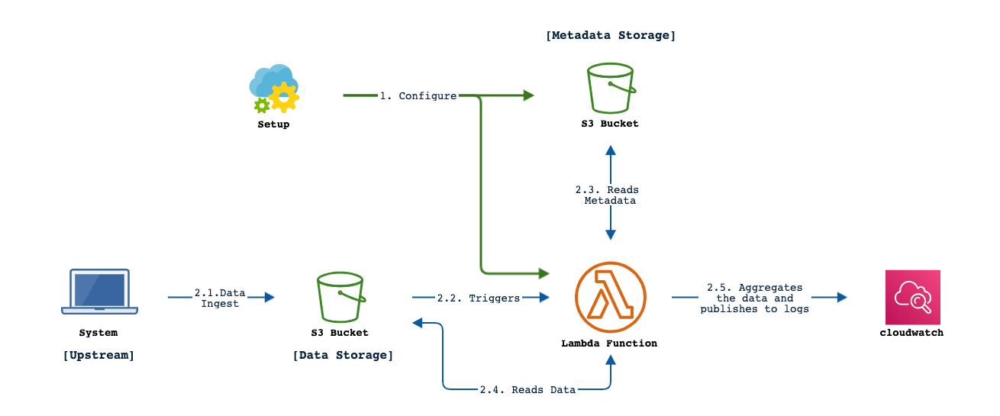

<div id="top"></div>

# Dataflow



# Setup Instructions
<p align="left"><a href="#top">Back to Top</a></p>

This document outlines the steps to configure and deploy Python Lambda functions with .zip file archives,


* [Step 1: Setup Python](#step-1-setup-python)
    + [Install pip](#install-pip)
    + [Install virtualenv](#install-virtualenv)
* [Step 2: Clone the repo](#step-2-clone-the-repo)
* [Step 3: Setup Python virtual Environment](#step-3-setup-python-virtual-environment)
* [Step 4: Package the modules](#step-4-package-the-modules)
    + [Package the third party modules](#package-the-third-party-modules)
    + [Package the code base](#package-the-code-base)
* [Step 5: Upload to S3 Bucket](#step-5-upload-to-s3-bucket)
    + [Upload to S3 Bucket (Console)](#upload-to-s3-bucket-console)
    + [Upload to S3 Bucket (API)](#upload-to-s3-bucket-api)
* [Step 6: Setup the lambda layer](#step-6--setup-the-lambda-layer)
    + [To create a layer (console)](#to-create-a-layer-console)
    + [To create a layer (API)](#to-create-a-layer-api)
* [Step 7: Setup the IAM execution role](#step-7-setup-the-iam-execution-role)
    + [To create an execution role (console)](#to-create-an-execution-role-console)
    + [To create an execution role (API)](#to-create-an-execution-role-api)
* [Step 8: Setup the Lambda function](#step-8-setup-the-lambda-function)
    + [To create Lambda function (console)](#to-create-lambda-function-console)
    + [To create Lambda function (API)](#to-create-lambda-function-api)
* [Step 9: Setup the Lambda Trigger](#step-9-setup-the-lambda-trigger)
* [Step 10: Setup CloudWatch Loggroup](#step-10-setup-cloudwatch-loggroup)

## Step 1: Setup Python
<p align="left"><a href="#top">Back to Top</a></p>

### Install pip

Install/Upgrade pip if it needed, 

```
python3 -m pip install --user --upgrade pip
```
```
python3 -m pip --version
```

### Install virtualenv

Install virtualenv if it is not present, 

```
python3 -m pip install --user virtualenv
```

## Step 2: Clone the repo
<p align="left"><a href="#top">Back to Top</a></p>

1. clone the repo

    ```bash
    git clone <repo url>
    ```

2. cd to the repo directory

    ```bash
    cd <datastream-sdk>
    ```

3. create a branch and make changes in the branch

    ```bash
    git checkout -b <branch-name>
    ```

4. Follow this document to create the configuration files customised for your stream, 
[Config files Setup Reference](config-setup.md)

## Step 3: Setup Python virtual Environment
<p align="left"><a href="#top">Back to Top</a></p>

Run the following commands from inside the project directory,
if not, `cd` to the directory
 
1. Create a virtual environment,

    ```bash
    python3 -m venv my-venv
    ```

2. Activate the virtual enviroment,

    ```bash
    source my-venv/bin/activate
    ```


## Step 4: Package the modules

<p align="left"><a href="#top">Back to Top</a></p>

### Package the third party modules

<i>Note: Ensure to package them in Linux Environment </i>

1. Ensure the current version of python is 3.8 or above

    ```bash
    (my-venv) $ python --version 
    Python 3.9.12
    ```

2. Install the required third party modules using pip

    ```bash
    (my-venv) $ python -m pip install -r base-requirements.txt -r cloud_modules_aws/requirements.txt
    ```

3. The list of installed modules can be checked via the following command,

    ```bash
    (my-venv) $ pip3 freeze
    boto3==1.21.37
    botocore==1.24.37
    httpagentparser==1.9.2
    jmespath==1.0.0
    numpy==1.22.3
    pandas==1.4.2
    python-dateutil==2.8.2
    pytz==2022.1
    s3transfer==0.5.2
    six==1.16.0
    urllib3==1.26.9
    ```

4. At this point we can leave from the virtual environment, 

    ```bash
    (my-venv) $ deactivate
    ```

5. Check the installed packages,

    ```bash
    ls -lrt my-venv/lib/python3.9/site-packages/
    ```

6. Create a `python` directory and copy them into this directory, 

    ```bash
    mkdir -vp python/
    ```

    ```bash
    cp -rv my-venv/lib python/
    ```

    ```bash
    ls -lrt python/lib/python3.9/site-packages/
    ```

7. Zip this directory to create a deployement package say, `ds_site-packages.zip`, 

    ```bash
    zip -r -g ds_site-packages.zip python
    ```

8. To check the contents of this zip, 

    ```bash
    unzip -l ds_site-packages.zip | tail
    ```

    Ensure the folder structure looks like below, 
    i.e of this format: `python/lib/python3.9/site-packages/*`, so that the lambda functions will be able to    import them.
    ```
    $  unzip -l ds_site-packages.zip | head
    Archive:  ds_site-packages.zip
      Length      Date    Time    Name
    ---------  ---------- -----   ----
            0  2022-04-25 17:57   python/
            0  2022-04-25 17:57   python/lib/
            0  2022-04-25 17:57   python/lib/python3.9/
            0  2022-04-25 17:57   python/lib/python3.9/site-packages/
            0  2022-04-25 17:57   python/lib/python3.9/site-packages/boto3-1.21.37.dist-info/
           83  2022-04-25 17:57   python/lib/python3.9/site-packages/boto3-1.21.37.dist-info/NOTICE
            4  2022-04-25 17:57   python/lib/python3.9/site-packages/boto3-1.21.37.dist-info/INSTALLER
    ```

###  Package the code base

1. Zip the following code base modules to create a deployement package say `ds_code-base.zip`.

    ```bash
    rm ds_code-base.zip
    zip -r -g ds_code-base.zip run_aggregations.py
    zip -r -g ds_code-base.zip cloud_modules_aws
    zip -r -g ds_code-base.zip aggregation_modules
    ```

2. To check the contents of the zip, 

    ```bash
    unzip -l ds_code-base.zip
    ```

## Step 5: Upload to S3 Bucket
<p align="left"><a href="#top">Back to Top</a></p>

Create S3 bucket and upload the code base and config files.

###  Upload to S3 Bucket (Console)

1. Create the S3 bucket.
2. Upload the following archives and configs to the S3 Bucket, 
    * ds_site-packages.zip
    * ds_code-base.zip 
    * configs

###  Upload to S3 Bucket (API)

1. Use aws configure to configure your credentials

    ```bash
    $ aws configure
    AWS Access Key ID [None]: [... enter your access key ID ...]
    AWS Secret Access Key [None]: [... enter your secret access key ...]
    Default region name [None]: [... enter region ...]
    Default output format [None]: 
    ```

2. Setup the variables to your preferred bucket name and region.

    ```bash
    my_s3_bucket="ds-test-bucket"
    my_region="us-east-1"
    ```

3. Create S3 bucket for uploading the zipped files and configs. 

    ```bash
    aws s3api create-bucket \
        --bucket ${my_s3_bucket} \
        --region ${my_region}
    ```

3. Upload the zip files and config files to this bucket, 

    ```bash
    aws s3 cp ds_site-packages.zip s3://${my_s3_bucket}/
    aws s3 cp ds_code-base.zip s3://${my_s3_bucket}/
    aws s3 cp configs s3://${my_s3_bucket}/configs/ --recursive
    ```

4.  Ensure that all files are uploaded,

    ```bash
    aws s3 ls s3://${my_s3_bucket}/ --recursive
    ```

    Example, 
    ```bash
    $ aws s3 ls s3://${my_s3_bucket}/ --recursive
    2022-04-25 18:03:36       1141 configs/all_custom_functions.json
    2022-04-25 18:03:36       5021 configs/all_datastream2_fields.json
    2022-04-25 18:03:36        192 configs/prov_site_with_time.json
    2022-04-25 18:03:36       1248 configs/provision.json
    2022-04-25 18:03:36      13411 configs/stream.json
    2022-04-25 18:04:22      12308 ds_code-base.zip
    2022-04-25 18:03:28   54901012 ds_site-packages.zip
    ```

## Step 6: Setup the lambda layer

<p align="left"><a href="#top">Back to Top</a></p>

Lambda layers provide a convenient way to package libraries and other dependencies that you can use with your Lambda functions. Using layers reduces the size of uploaded deployment archives and makes it faster to deploy your code.

### To create a layer (console)

1. Open the Layers page of the Lambda console.
2. Choose Create layer.
3. Under Layer configuration, for Name, enter a name for your layer.
4. (Optional) For Description, enter a description for your layer.
5. To upload your layer code, do one of the following:
    1. To upload a file from Amazon S3, choose Upload a file from Amazon S3. Then, for Amazon S3 link URL, enter a link to the file.

6. (Optional) For Compatible instruction set architectures, choose one value or both values.
7. (Optional) For Compatible runtimes, choose up to 15 runtimes.
8. (Optional) For License, enter any necessary license information.
9. Choose Create.


### To create a layer (API)

To create a layer, use the publish-layer-version command with a name, description, .zip file archive, a list of runtimes and a list of architectures that are compatible with the layer. 
The runtimes and architecture parameters are optional.

1. Setup the variables

    ```bash
    my_layer_name="ds-site-packages"
    my_s3_bucket="ds-test-bucket"
    my_zip_file="ds_site-packages.zip"
    ```

2. Run the API to create the layer

    ```bash
    aws lambda publish-layer-version \
        --layer-name ${my_layer_name} \
        --description "My Python layer with third party modules" \
        --license-info "MIT" \
        --content S3Bucket=${my_s3_bucket},S3Key=${my_zip_file} \
        --region us-east-1 \
        --compatible-runtimes python3.9
    ```
    
3. Note down the `LayerVersionArn` from the above result. 
This will be used to tag this layer for importing to the lamdba function.

4. Sample result, 

    ```json
    {
        "Content": {
            "Location": "[]...]",
            "CodeSha256": "[...]",
            "CodeSize": 54901012
        },
        "LayerArn": "arn:aws:lambda:us-east-1:553450038100:layer:ds-site-packages",
        "LayerVersionArn": "arn:aws:lambda:us-east-1:553450038100:layer:ds-site-packages:1",
        "Description": "My Python layer with third party modules",
        "CreatedDate": "2022-04-25T12:42:16.114+0000",
        "Version": 1,
        "CompatibleRuntimes": [
            "python3.9"
        ],
        "LicenseInfo": "MIT"
    }
    ```

## Step 7: Setup the IAM execution role
<p align="left"><a href="#top">Back to Top</a></p>

Create the execution role that gives your Lambda function permission to access AWS resources.

### To create an execution role (console)

1. Open the Roles page in the IAM console.
2. Choose Create role.
3. Create a role with the following properties:

    <table>
    <tbody>
    <tr align="left" valign="top">
        <th> Trusted entity </th> 
        <td> Lambda </td>
    </tr>
    <tr align="left" valign="top">
        <th> Permissions policy </th>
        <td> AWSLambdaBasicExecutionRole </br> AmazonS3ReadOnlyAccess </td>
    </tr>
    <tr align="left" valign="top">
        <th> Role name </th>
        <td> Provide a unique role name <br>say, <code>lambda-test-exec-role</code> </td>
    </tr>
    </tbody>
    </table>


### To create an execution role (API)

1. Setup the variables

    ```bash
    my_role_name="lambda-test-exec-role"
    ```

2. Create IAM role for executing lambda

    ```bash
    aws iam create-role \
        --role-name $my_role_name \
        --assume-role-policy-document '{
                    "Statement": 
                        [
                            {
                                "Effect": "Allow",
                                "Principal": {
                                    "Service": "lambda.amazonaws.com"
                                },
                                "Action": "sts:AssumeRole"
                            }
                        ]
        }'
    ```

    Sample result, 

    ```json
    {
        "Role": {
            "Path": "/",
            "RoleName": "lambda-test-exec-role",
            "RoleId": "[...]",
            "Arn": "arn:aws:iam::553450038100:role/lambda-test-exec-role",
            "CreateDate": "2022-04-25T13:30:04Z",
            "AssumeRolePolicyDocument": {
                "Statement": [
                    {
                        "Effect": "Allow",
                        "Principal": {
                            "Service": "lambda.amazonaws.com"
                        },
                        "Action": "sts:AssumeRole"
                    }
                ]
            }
        }
    }
    ```

3. Note down the ARN from the above result. This will be used for tagging this role to the lambda function.

4. Add `AmazonS3ReadOnlyAccess` to Permissions policies for this IAM role 

    ```bash
    aws iam attach-role-policy \
        --role-name $my_role_name \
        --policy-arn arn:aws:iam::aws:policy/AmazonS3ReadOnlyAccess

    ```

## Step 8: Setup the Lambda function
<p align="left"><a href="#top">Back to Top</a></p>

### To create Lambda function (console)

1. In the AWS Lambda Console, Under Functions, Create the new lambda function with Python runtime.
    - In _Change default execution role_, choose _Use an existing role_ and add the existing role created from the previous step

2. Select code settings in function
   - Code source ->  upload from -> Amazon s3 location
   - provide the s3 location of S3 bucket where we uploaded the code base (say, ds_code-base.zip)

3. Set **Configuration settings**
    - Prefered timeout: 5-15 min ~
    - Set the following Environment Variables :
        - S3_METADATA_BUCKET:  {your metadata bucketname}
        - S3_METADATA_PATH: {directory with the configs}

4. Configure **Runtime settings**
    - Select  : python 3.8 or above
    - Handler : cloud_modules_aws.lambda_handler
    - Architecture : x86_64

5. Add **Layers**
    - Choose the previously created layer from _Custom layers_
    - Choose the Layer version
    - Proceed to add 

### To create Lambda function (API)


1. Setup the variables

    1. Substitue `my_role_arn` from [To create an execution role (API)](#to-create-an-execution-role-api)
    2. Subsitute `my_layer_arn` from [To create a layer (API)](#to-create-a-layer-api)

    ```bash
    my_function="ds-test-function"
    my_s3_bucket="ds-test-bucket"
    my_zip_file="ds_code-base.zip"
    config_path="configs"
    my_role_arn="arn:aws:iam::553450038100:role/lambda-test-exec-role"
    my_layer_version_arn="arn:aws:lambda:us-east-1:553450038100:layer:ds-site-packages:1"

    ```

4. create the Lambda function

    ```bash
    aws lambda create-function \
        --architectures x86_64 \
        --memory-size 1024 \
        --function-name ${my_function} \
        --runtime python3.9 \
        --role ${my_role_arn} \
        --code S3Bucket=${my_s3_bucket},S3Key=${my_zip_file} \
        --region us-east-1 \
        --handler cloud_modules_aws.lambda_handler \
        --layers ${my_layer_version_arn}
        --environment "Variables={S3_METADATA_BUCKET=${my_s3_bucket},S3_METADATA_PATH=${config_path}}" \
    ```

    Sample result, 
    ```json
    {
        "FunctionName": "ds-test-function",
        "FunctionArn": "arn:aws:lambda:us-east-1:553450038100:function:ds-test-function",
        "Runtime": "python3.9",
        "Role": "arn:aws:iam::553450038100:role/lambda-test-exec-role",
        "Handler": "cloud_modules_aws.lambda_handler",
        "CodeSize": 12308,
        "Description": "",
        "Timeout": 3,
        "MemorySize": 1024,
        "LastModified": "2022-04-25T14:14:03.953+0000",
        "CodeSha256": "[...]",
        "Version": "$LATEST",
        "Environment": {
            "Variables": {
                "S3_METADATA_BUCKET": "ds-test-bucket",
                "S3_METADATA_PATH": "configs"
            }
        },
        "TracingConfig": {
            "Mode": "PassThrough"
        },
        "RevisionId": "e1d2c063-fe45-48da-b2ae-aef5166faccd",
        "Layers": [
            {
                "Arn": "arn:aws:lambda:us-east-1:553450038100:layer:ds-site-packages:1",
                "CodeSize": 54901012
            }
        ],
        "State": "Pending",
        "StateReason": "The function is being created.",
        "StateReasonCode": "Creating",
        "PackageType": "Zip",
        "Architectures": [
            "x86_64"
        ]
    }
    ```

## Step 9: Setup the Lambda Trigger
<p align="left"><a href="#top">Back to Top</a></p>

1. In the Lambda function console, Select Add Trigger

2. Under S3 trigger, choose the S3 bucket that is intend to receive the data

When you configure an S3 trigger using the Lambda console, the console modifies your function's resource-based policy to allow Amazon S3 to invoke the function.

## Step 10: Setup CloudWatch Loggroup
<p align="left"><a href="#top">Back to Top</a></p>

1. In the CloudWatch Console, create a log group using > _Create Log Group_

2. Specify the Log group name as _/aws/lambda/{lambda function name}_


# References
<p align="left"><a href="#top">Back to Top</a></p>

- [AWS Lambda - Deploy Python Lambda functions with .zip file archives](https://docs.aws.amazon.com/lambda/latest/dg/python-package.html)
- [AWS Lambda - Creating and sharing Lambda layers](https://docs.aws.amazon.com/lambda/latest/dg/configuration-layers.html)
- [Installing packages using pip and virtual environments](https://packaging.python.org/en/latest/guides/installing-using-pip-and-virtual-environments/)