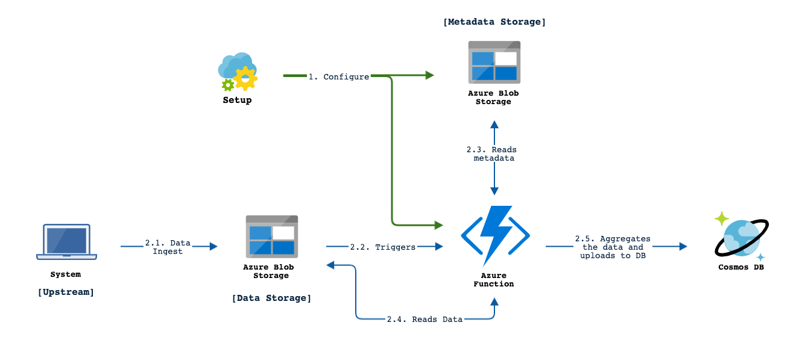

# DataFlow

# Azure SDK provisioning 

This document describes 2 methods of provisioning 
- [Deployment using Azure Portal](Azure-portal-deployment.md)
- [Zip deployment using Azure CLI](Azure-zip-deployment.md)

Any of these can be followed to setup this Azure function.
In this case the Azure function gets triggered whenever there is new file upload in the blob, reads the file, aggregates and uploads to Cosmos DB
