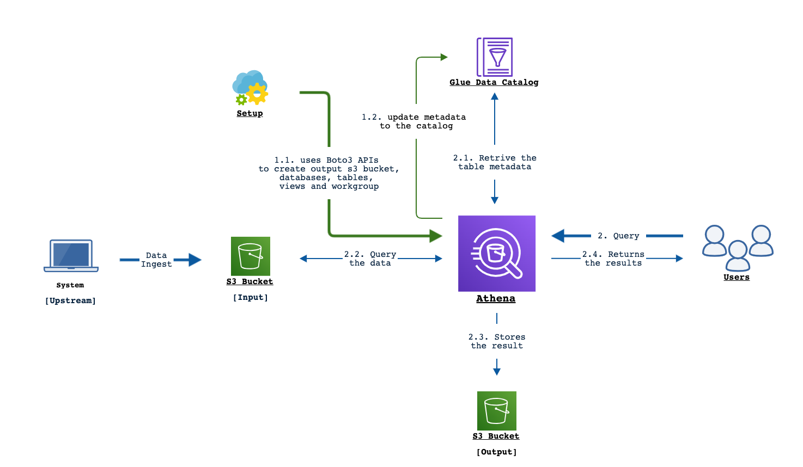

## Table of Contents

* [Summary](#summary)
  * [Logical Flow](#logical-flow)
  * [Input Configuration Files](#input-configs)
    * [STREAM_JSON](#stream-json)
    * [LOG_FIELD_MAPS](#log-field-maps)
    * [FORMULAS_JSON](#formulas-json)
* [Setup workspace](#setup-workspace)
  * [Python Setup](#python-setup)
    * [How to install the Python dependent modules?](#install-dep-mods)
  * [AWS Setup](#aws-setup)
  * [Input File Setup](#input-file-setup)
    * [How to pull Stream ID Configs?](#pull-stream-configs)
      * [Get Started with APIs](#getting-started)
      * [API Examples](#api-examples)
* [Script Usage](#usage)
  * [Supported Command Line Arguments](#cmdline-args)
* [Examples](#examples)
  * [Running in Normal mode](#normal)
  * [Running in Dryrun mode](#dryrun)
  * [Sample queries on Athena](#samplequery)
* [References](#refs)

## <a name="summary">Summary</a>

Amazon Athena is an interactive query service that makes it easy to analyze data directly in Amazon Simple Storage Service (Amazon S3) using standard SQL.

Athena is serverless, so there is no infrastructure to set up or manage, and you pay only for the queries you run.

This Script creates a basic Athena setup in your S3 account i.e by creating the necessary S3 bucket, Database, Table and an aggregated View for the data stored for your stream in S3 bucket. So we can use this table or view to query the data.

This Athena setup works only when all the data in your bucket is in Structured or JSON format. A bucket containing both JSON and STRUCTURED data will not work with this Athena setup.

### <a name="logical_flow">Logical Flow</a>



Detailed Reference: <a href="https://docs.aws.amazon.com/athena/latest/ug/getting-started.html">Amazon Athena - Getting Started</a>

Following will be list of action items performed by this script,

1. Create S3 Bucket
   - Create a bucket in the specified region.
     - If no region is provided, it uses the region from Stream Json file.
   - This S3 bucket is used to store the Athena Query results of the DDL (CREATE, REPLACE) statements run by this package.
   - If the bucket already exists and you have access to it, no bucket will be created.
2. Create a Database
   - Creates the provided database if it doesn't exists in Athena
3. Create a Table
   - Creates the provided table if it doesn't exist in Athena
4. Create a View
   - Creates/Replaces the provided view in Athena if it doesn't exists

### <a name="input-configs">Input Configuration Files </a>

The following are the details on the list of input configuration files used by this package

* [STREAM_JSON](#stream-json)
* [LOG_FIELD_MAPS](#log-field-maps)
* [FORMULAS_JSON](#formulas-json)

#### <a name="stream-json">STREAM_JSON</a>

1. JSON file with stream details.
2. The script uses this file to get the S3 location and parse the data format, columns stored in the S3 bucket.
3. Hence this stream ID file should match the format of the data uploaded in the S3 bucket you want to query from.
4. This can be pulled from portal using the steps mentioned [here](#pull-stream-configs)
5. Default: `conf/stream_temp.json`
6. A customized version of this JSON file can be passed to the script using `--stream_json <STREAM_JSON>` argument.

#### <a name="log-field-maps">LOG_FIELD_MAPS</a>

1. This JSON file details the mapping between the field id, its name, data type, field description, potential formulas to aggregate the fields.
2. The `"name"` tag represents the name of this column in Athena Table.
3. The `"agg"` tag consists of the list of functions that can be supported by this field, provided that field is selected in `stream_json` file. Thus removing it from `"agg"` list disables the function for that field.
4. This file also has `"others"` field, that helps to add aggregate functions common to all fields. like total lines etc.
5. Default: `conf/log_fields.json`
6. A customized version of this JSON file can be passed to the script using `--log_field_maps <LOG_FIELD_MAPS>` argument.

Example

```json
{
    ...
    "1005": {
        "name": "bytes",
        "cname": "Bytes",
        "dtype": "bigint",
        "desc": "The content bytes served in the response body. For HTTP/2, this includes overhead bytes",
        "agg": [
            "AvgbytesPerSecond",
            "TotalbytesPerSecond"
        ]
    },
    ...
    "others": {
        "agg": [
            "totalRequests"
        ],
        "desc" : "This is an aggregated field; Used for creating views"
    }
}
```

#### <a name="formulas-json">FORMULAS_JSON</a>

1. This JSON file contains the dimensions and the detailed formulas for the aggregate functions specified in `log_field_maps` JSON.
2. The dimension tag supports 2 field types say direct and/or derived fields
   1. The direct fields are the list of datasetFieldId in the stream json file.
   2. The derived fields are list of function names specified under the queries section in this JSON file.
3. The formulas are sql functions with column name represented as `_var_`. This will be replaced by the respective column name during the query generation.
4. The functions specified here can be an aggregate(`SUM`, `AVG`, etc) or non aggregate function (`SUBSTR`, `URL_DECODE` etc). However all the enabled non aggregated functions needs to be added to derived dimension.
5. Default: `conf/formulas.json`
6. A customized version of this JSON file can be passed to the script using `--formulas_json <FORMULAS_JSON>` argument.

Example,

```json
{
    "dimension": {
        "direct": [
            "1000",
            "1001"
        ],
        "derived": [
            "req_5min"
        ]
    },
    "queries": {
        "hits_1xx": {
            "q": "sum(case when _var_ / 100 = 1 then 1 else 0 end)",
            "desc": "The count of 1xx error codes for this time interval"
        },
        "hits_2xx": {
            "q": "sum(case when _var_ / 100 = 2 then 1 else 0 end)",
            "desc": "The count of 2xx error codes for this time interval"
        },
        ...
        ...,
        "req_5min": {
            "q": "from_unixtime(_var_ - (_var_ % 300))",
            "desc": "Request Time rounded to the nearest 5 min interval"
        }
    }
}
```

## <a name="setup-workspace">Setup workspace</a>

### <a name="python-setup">Python Setup</a>

Note: Minimum Requirement - _**python 3.7**_ version

1. Ensure Python is installed in the machine.
   1. Install using the steps mentioned in this link, <a href="https://www.python.org/downloads/">Python </a>
2. Install the dependent python third-party modules using the steps mentioned [here](#install-dep-mods)

#### <a name="install-dep-mods">How to install the Python dependent modules?</a>

This packages uses the following modules,

- argparse
- logging
- json
- boto3
- botocore

Use pip to install the third-party modules if they doesn't exist in the machine,

```python
python3 -m pip install <module>
```

##### Using Requirements File

Alternatively use the `requirements.txt` file provided in this package.
And install all the list of requirements specified in the Requirements File,

```python
python3 -m pip install -r requirements.txt
```

### <a name="aws-setup">AWS Setup</a>

1. In order to configure in Athena, Attach the following Policies to your IAM user in S3,

   ```
   "arn:aws:iam::aws:policy/AmazonS3FullAccess",
   "arn:aws:iam::aws:policy/AmazonAthenaFullAccess"
   ```

   This needs S3 access to write the query outputs and Athena access to run DDL Statements

   Reference: <a href="https://docs.aws.amazon.com/athena/latest/ug/setting-up.html"> Amazon Athena - Setting Up </a>
2. Install and configure boto3 by following the steps mentioned in this tutorial, <a href="https://boto3.amazonaws.com/v1/documentation/api/latest/guide/quickstart.html">Boto3 - Quickstart</a>. In brief,

   1. <a href="https://boto3.amazonaws.com/v1/documentation/api/latest/guide/quickstart.html#install-boto3"> Install Boto3</a>

      ```python
      pip install boto3
      ```

      Note: you might have already installed this module if used the `requirements.txt` file in the previoud step.
   2. <a href="https://boto3.amazonaws.com/v1/documentation/api/latest/guide/quickstart.html#configuration">Set up authentication credentials for your AWS account</a> using either the IAM Console or the <a href="https://aws.amazon.com/cli/">AWS CLI</a>. Once you have  the access key and secret access key, run the following  command,

      ```python
      aws configure
      ```

      This creates the `~/.aws/credentials` file with the access key and secret access key

### <a name="input-file-setup">Input File Setup</a>

1. Pull the stream ID configs using the steps mentioned [here](#pull-stream-configs)
2. This stream ID file will be passed to the script using `--stream_json <STREAM_JSON>` argument.

#### <a name="pull-stream-configs">How to pull Stream ID Configs?</a>

Use the following command to get the respective stream id details and save it to `test.json`,

```
http --auth-type=edgegrid -a default: -o test.json ":/datastream-config-api/v1/log/streams/<streamid>"
```

This stream ID file will be passed to the script using `--stream_json <STREAM_JSON>` argument.

In order to run this command successfully, use the following steps to setup your machine.

##### <a name="getting-started">Get Started with APIs</a>

Set up the required access using the detailed steps mentioned here,
<a href="https://developer.akamai.com/api/getting-started">Get Started with APIs </a>

In brief,

Note: you might have already installed the following modules if used the `requirements.txt` file in the previoud step.

1. Install `HTTPie`,

   ```
   python -m pip install --upgrade httpie
   ```
2. Install `httpie-edgegrid`,

   ```
   python -m pip install httpie-edgegrid
   ```
3. Set up your `/Users/{login}/.edgerc` file

Now we are good to run our APIs.

##### <a name="api-examples">API Examples</a>

<table>
    <tr>
        <th>
            <a href="https://developer.akamai.com/api/core_features/datastream2_config/v1.html">DataStream 2
                Configuration API v1</a> - Reference
        </th>
        <th>
            Example
        </th>
    </tr>
    <tr>
        <td valign="top">
            <a href="https://developer.akamai.com/api/core_features/datastream2_config/v1.html#gettemplatename">List data set fields
</a>
        </td>
        <td>
            <code>
                http --auth-type=edgegrid -a default: ":/datastream-config-api/v1/log/datasets/template/EDGE_LOGS"
            </code>
        </td>
    </tr>
    <tr>
        <td valign="top">
            <a href="https://developer.akamai.com/api/core_features/datastream2_config/v1.html#getstreams">List all streams</a>
        </td>
        <td>
            <code>
                http --auth-type=edgegrid -a default: ":/datastream-config-api/v1/log/streams"
            </code>
        </td>
    </tr>
    <tr>
        <td valign="top">
            <a href="https://developer.akamai.com/api/core_features/datastream2_config/v1.html#getstream">Get particular stream details</a>
        </td>
        <td>
            <code>
                http --auth-type=edgegrid -a default: ":/datastream-config-api/v1/log/streams/{streamID}"
            </code>
            <br/>
        </td>
    </tr>
</table>

## <a name="usage">Script Usage</a>

```python
python loadtoathena.py
```

### <a name="cmdline-args">Supported Command Line Arguments</a>

```python
% python loadtoathena.py --help
usage: loadtoathena.py [-h] [--loglevel {critical,error,warn,info,debug}] [--dryrun] [--log_field_maps LOG_FIELD_MAPS] [--formulas_json FORMULAS_JSON] [--stream_json STREAM_JSON]
                       [--out_bucket OUT_BUCKET] [--out_bucket_path OUT_BUCKET_PATH] [--out_bucket_region OUT_BUCKET_REGION] [--db_name DB_NAME] [--table_name TABLE_NAME] [--view_name VIEW_NAME]
                       [--workgroup WORKGROUP]

Helps setting up an athena table and view that helps to query the datastream 2 logs stored in S3 buckets

optional arguments:
  -h, --help            show this help message and exit
  --loglevel {critical,error,warn,info,debug}
                        logging level.
                        (default: info)

  --dryrun              shows the commands that will be executed by this script
                        without actually running it.
                        the default loglevel for this mode is debug.
                        (default: False)

  --log_field_maps LOG_FIELD_MAPS
                        json file with field id to name mapping and aggregate functions.
                        (default: conf/log_fields.json)

  --formulas_json FORMULAS_JSON
                        json file with formulas for the aggregate functions.
                        (default: conf/formulas.json)

  --stream_json STREAM_JSON
                        json file with stream details.
                        (default: conf/sample_stream.json)

  --out_bucket OUT_BUCKET
                        output bucket to store athena query results.
                        (default: athena-result-bucket-<STREAM_JSON:streamId>)

  --out_bucket_path OUT_BUCKET_PATH
                        output bucket path to store athena query results.
                        (default: )

  --out_bucket_region OUT_BUCKET_REGION
                        s3 region for the output bucket that stores query results.
                        if not provided, the default region will be parsed from the stream json file.
                        (default: STREAM_JSON:connectors["region"]

  --db_name DB_NAME     database name to create.
                        (default: athena_db_<STREAM_JSON:streamId>)

  --table_name TABLE_NAME
                        table name to create.
                        (default: athena_table_<STREAM_JSON:streamId>_<STREAM_JSON:streamVersionId>)

  --view_name VIEW_NAME
                        view name to create.
                        (default: athena_view_<STREAM_JSON:streamId>_<STREAM_JSON:streamVersionId>)

  --workgroup WORKGROUP
                        The workgroup name to create to execute athena queries.
                        In order to store the query results in the provided s3://<out_bucket>/<out_bucket_path>,
                        ensure to switch to this workgroup while running queries.
                        (default: athena_workgroup_<STREAM_JSON:streamId>)
```

## <a name="example">Examples</a>

### <a name="normal">Running in Normal mode</a>

This is an example of running the script in normal cases.
As mentioned below, this uses the credentials in `~/.aws/credentials` created via aws configure step above and creates the output bucket, database, table and an aggregated view.

```python
% python loadtoathena.py
 2715| 2021-11-10 17:11:56,097|    loadtoathena:  590|     INFO| starting ...
 2715| 2021-11-10 17:11:56,099|    loadtoathena:   76|     INFO| creating bucket datastream-athena-test4 in region us-east-1
 2715| 2021-11-10 17:11:56,118|     credentials: 1222|     INFO| Found credentials in shared credentials file: ~/.aws/credentials
 2715| 2021-11-10 17:11:57,884|    loadtoathena:   92|     INFO| bucket exists.. not creating
 2715| 2021-11-10 17:11:57,887|    loadtoathena:  231|     INFO| creating database: datastreamAthenaTestDB3
 2715| 2021-11-10 17:11:59,974|    loadtoathena:  211|     INFO| response code: 200
 2715| 2021-11-10 17:11:59,976|    loadtoathena:  352|     INFO| creating table: `datastreamAthenaTestDB3`.`datastreamAthenaTestTable2`
 2715| 2021-11-10 17:12:04,044|    loadtoathena:  211|     INFO| response code: 200
 2715| 2021-11-10 17:12:04,047|    loadtoathena:  441|     INFO| creating view: "datastreamAthenaTestDB3"."datastreamAthenaAggView2"
 2715| 2021-11-10 17:12:05,224|    loadtoathena:  211|     INFO| response code: 200
 2715| 2021-11-10 17:12:05,226|    loadtoathena:  633|     INFO| Finished setting up!
```

### <a name="dryrun">Running in Dryrun mode</a>

This mode just prints the potential commands without actually running it.
Will be helpful for debugging purposes. In this mode, the loglevel gets defaults to DEBUG mode.

```python
% python loadtoathena.py --dryrun
91516| 2021-11-17 18:09:11,061|    loadtoathena:  633|     INFO| in dry run mode.. loglevel switched to debug mode
91516| 2021-11-17 18:09:11,061|    loadtoathena:  635|     INFO| starting...
91516| 2021-11-17 18:09:11,065|    loadtoathena:   78|     INFO| creating bucket datastream-athena-test1 in region us-east-1
91516| 2021-11-17 18:09:11,065|    loadtoathena:   81|     INFO| in dry run mode.. not running!
91516| 2021-11-17 18:09:11,065|    loadtoathena:  237|     INFO| creating database: datastreamAthenaTestDB1
91516| 2021-11-17 18:09:11,066|    loadtoathena:  194|    DEBUG| executing query...

CREATE DATABASE IF NOT EXISTS `datastreamAthenaTestDB1`
  COMMENT 'Database to store Athena query results'

91516| 2021-11-17 18:09:11,066|    loadtoathena:  195|    DEBUG| with query execution context...
{
  "Catalog": "AwsDataCatalog"
}
91516| 2021-11-17 18:09:11,066|    loadtoathena:  198|    DEBUG| with result configuration...
{
  "OutputLocation": "s3://datastream-athena-test1/"
}
91516| 2021-11-17 18:09:11,066|    loadtoathena:  200|    DEBUG| in dry run mode.. not running!
91516| 2021-11-17 18:09:11,066|    loadtoathena:  374|     INFO| creating table: `datastreamAthenaTestDB1`.`datastreamAthenaTestTable1`
91516| 2021-11-17 18:09:11,066|    loadtoathena:  194|    DEBUG| executing query...

CREATE EXTERNAL TABLE IF NOT EXISTS `datastreamAthenaTestDB1`.`datastreamAthenaTestTable1` (
 `version` string,
 `cp` string,
 `reqId` string,
 `reqTimeSec` bigint,
 `bytes` bigint,
 `col5` string,
 `cliIP` string,
 `statusCode` bigint,
 `proto` string,
 `reqHost` string,
 `reqMethod` string,
 `reqPath` string,
 `reqPort` string,
 `rspContentLen` string,
 `rspContentdtype` string,
 `UA` string,
 `accLang` string,
 `cookie` string,
 `range` string,
 `referer` string,
 `xForwardedFor` string,
 `reqEndTimeMSec` string,
 `turnAroundTimeMSec` bigint,
 `transferTimeMSec` bigint,
 `tlsOverheadTimeMSec` string,
 `tlsVersion` string,
 `customField` string,
 `edgeIP` string,
 `errorCode` string,
 `objSize` bigint,
 `uncompressedSize` bigint,
 `overheadBytes` bigint,
 `totalBytes` bigint,
 `queryStr` string,
 `dnsLookupTimeMSec` bigint,
 `maxAgeSec` bigint,
 `cacheStatus` string,
 `cacheRefreshSrc` string
)
ROW FORMAT DELIMITED
    FIELDS TERMINATED BY ' '
    ESCAPED BY '\\'
    LINES TERMINATED BY '\n'
STORED AS
    INPUTFORMAT 'org.apache.hadoop.mapred.TextInputFormat'
    OUTPUTFORMAT 'org.apache.hadoop.hive.ql.io.HiveIgnoreKeyTextOutputFormat'
LOCATION 's3://datastreambztest/test-data/'

91516| 2021-11-17 18:09:11,066|    loadtoathena:  195|    DEBUG| with query execution context...
{
  "Database": "datastreamAthenaTestDB1",
  "Catalog": "AwsDataCatalog"
}
91516| 2021-11-17 18:09:11,066|    loadtoathena:  198|    DEBUG| with result configuration...
{
  "OutputLocation": "s3://datastream-athena-test1/"
}
91516| 2021-11-17 18:09:11,066|    loadtoathena:  200|    DEBUG| in dry run mode.. not running!
91516| 2021-11-17 18:09:11,066|    loadtoathena:  475|     INFO| creating view: "datastreamAthenaTestDB1"."datastreamAthenaAggView1"
91516| 2021-11-17 18:09:11,066|    loadtoathena:  194|    DEBUG| executing query...

CREATE OR REPLACE VIEW "datastreamAthenaTestDB1"."datastreamAthenaAggView1" AS
 SELECT "cp" ,
  from_unixtime(reqTimeSec - (reqTimeSec % 300)) as "req_5min",
  url_decode(UA) as "user_agent",
  avg(bytes) as "AvgbytesPerSecond",
  sum(bytes) as "TotalbytesPerSecond",
  sum(case when statusCode / 100 = 1 then 1 else 0 end) as "1xx",
  sum(case when statusCode / 100 = 2 then 1 else 0 end) as "2xx",
  sum(case when statusCode / 100 = 3 then 1 else 0 end) as "3xx",
  sum(case when statusCode / 100 = 4 then 1 else 0 end) as "4xx",
  sum(case when statusCode / 100 = 5 then 1 else 0 end) as "5xx",
  sum(case when statusCode = 201 then 1 else 0 end) as "201_hits",
  sum(case when cacheStatus = '1' then 1 else 0 end) as "numCacheHit",
  sum(case when cacheStatus = '0' then 1 else 0 end) as "numCacheMiss",
  (sum(case when cacheStatus = '1' then 1 else 0 end) * 100.00)/count(*) as "offloadRate",
  count(*) as "totalRequests"
 FROM "datastreamAthenaTestDB1"."datastreamAthenaTestTable1"
 GROUP BY 3, "cp", 2

91516| 2021-11-17 18:09:11,067|    loadtoathena:  195|    DEBUG| with query execution context...
{
  "Database": "datastreamAthenaTestDB1",
  "Catalog": "AwsDataCatalog"
}
91516| 2021-11-17 18:09:11,067|    loadtoathena:  198|    DEBUG| with result configuration...
{
  "OutputLocation": "s3://datastream-athena-test1/"
}
91516| 2021-11-17 18:09:11,067|    loadtoathena:  200|    DEBUG| in dry run mode.. not running!
91516| 2021-11-17 18:09:11,067|    loadtoathena:  682|     INFO| Finished setting up!
```

### <a name="samplequery">Sample Queries on Athena</a>

```sql
-- Select the workgroup and database created using the script on Athena Query portal.

-- To view the uploaded records in a tabular form run the below query:
SELECT * FROM "athena_db_1234"."athena_table_1234_1" limit 10;

-- To view the aggregate results query the view created for the stream.
SELECT * FROM "athena_db_1234"."athena_view_1234_13" limit 10;
```

The output of the queries run on Athena are stored in a separate bucket created in the same region as the stream. Each query creates 2 output files a random-filename.csv which contains the results of the query and a metadata file which describes the column structure and datatypes of the table queried.

NOTE : If table_name and view_name provided are the same, only table will be created. Ensure different names are provided for both and that they do not contain any special characters.

## <a name="refs">References</a>

- <a href="https://developer.akamai.com/api/core_features/datastream2_config/v1.html">DataStream 2 Configuration API v1</a>
- <a href="https://learn.akamai.com/en-us/webhelp/data-stream/data-stream-user-guide/GUID-C283EAF6-70B7-4390-AD27-99E37306DE2E.html">DataStream 2 User Guide</a>
- <a href="https://docs.aws.amazon.com/athena/latest/ug/ddl-sql-reference.html">SQL Reference for Amazon Athena</a>
- <a href="https://aws.amazon.com/blogs/big-data/top-10-performance-tuning-tips-for-amazon-athena/">Top 10 Performance Tuning Tips for Amazon Athena </a>
